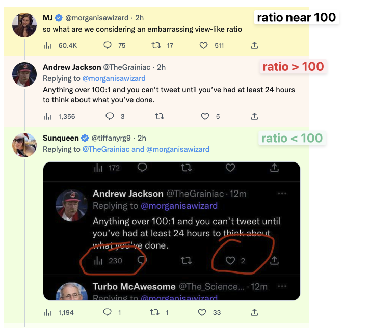

Chrome extension that highlights tweets by view/like ratio:



## Installation

```
$ ./build
```

That writes the unpacked extension to `dist/`. Then open `chrome://extensions`, turn on Developer Mode, click Load Unpacked, and open `dist/`. Then open any Twitter thread, [example](https://twitter.com/ingelramdecoucy/status/1606120892915777536).
